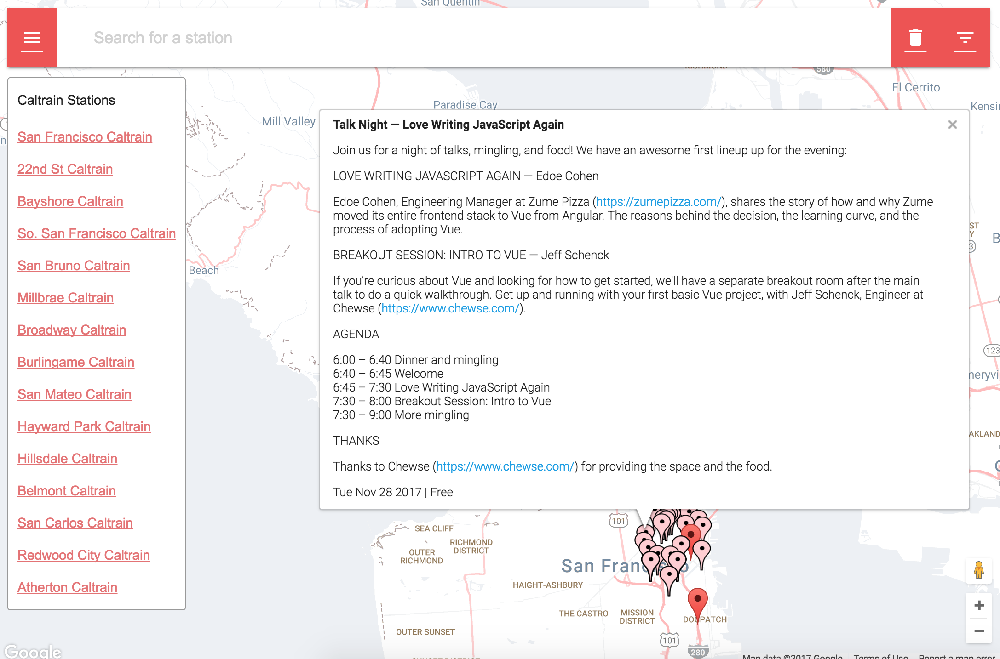
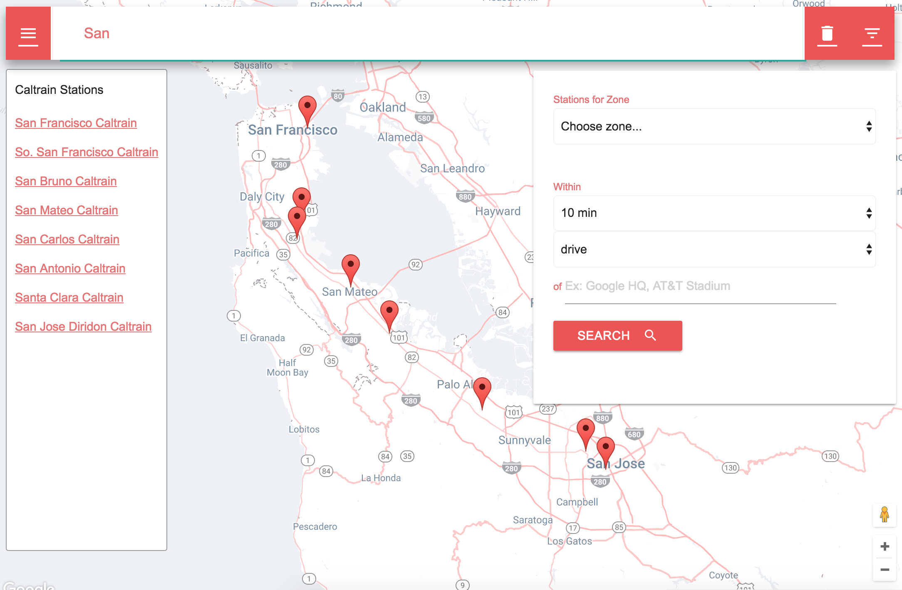

# Caltrain & Meetups Map
This web app helps you find the right Caltrain stations to take for that meetup you want to attend.

## Screenshots
#### Meetups View

#### Filtered Stations View

## Features
* Select each station to see the numerous tech meetups happening near the station within the next 2 weeks.
* Toggle the list of Caltrain stations by clicking on the top-left hamburger Menu button.
* Toggle the filter options by clicking on the top-right "Filter Options" button.
* Type in the search bar to see only the Caltrain stations that match the search term.
* In addition to the text search, you can also concurrently or independently filter by Zone from the filters box, so you know how much that ride will cost.
* Lastly, you can filter Caltrain stations by those reachable within a certain time and various modes of transpotation.

## Setup & Installation
1. As all dependencies are loaded via content delivery networks (CDN), there is no local dependency graph to setup.
2. Download the project and open into a browser the `index.html` file at the root of the project directory.

## APIs & Credits
* [Caltrain API via Transit.land](https://transit.land/api/v1/stops?served_by=o-9q9-caltrain)
* [Meetup.com](https://meetup.com)
* [Eventbrite.com](https://eventbrite.com)
* [jQuery](https://jquery.com/)
* [Google Maps](https://developers.google.com/maps/)
* [Google Fonts](https://fonts.googleapis.com)
* [Knockout.js](knockoutjs.com)
* [Materialize](http://materializecss.com/)
* [Balloon.css](https://kazzkiq.github.io/balloon.css/)
* [Dropoff3 Google Maps style](https://snazzymaps.com/style/26787/dropoff-3) by Jim Jordan

This Neighborhood Map Project satisfies the fifth requirement of Udacity's Fullstack Development Course.